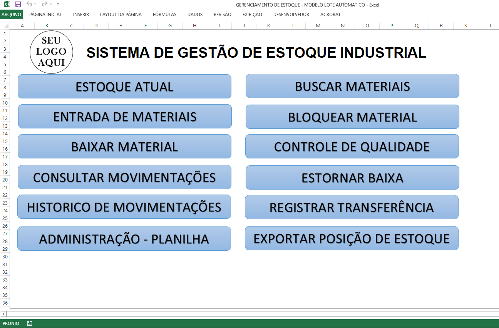
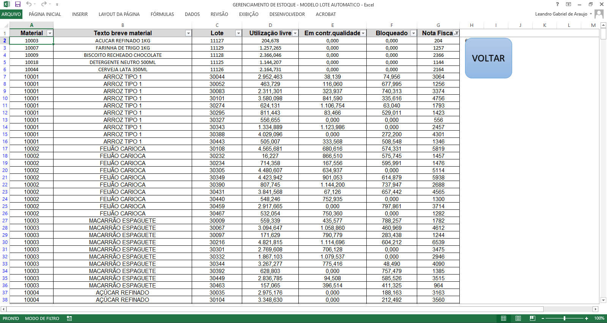
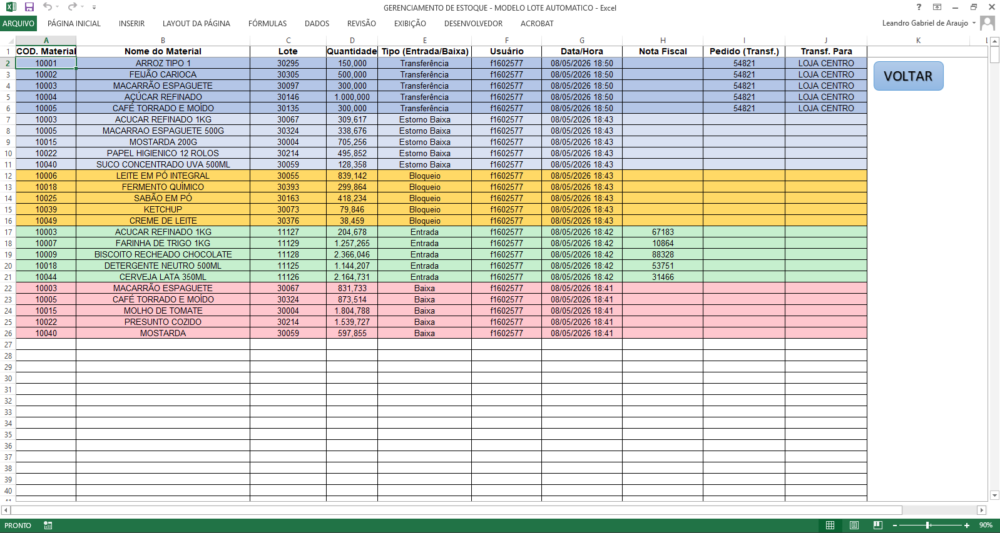

# Sistema de Gestão de Estoque VBA

Sistema desenvolvido em Excel VBA para controle de estoque industrial de materiais diversos (estoque de produtos acabados ou matérias-primas)

---

## Funcionalidades

- Controle de entradas
- Controle de baixas
- Gestão de lotes
- Controle de qualidade
- Bloqueio/liberação de materiais
- Transferências
- Estorno de baixa
- Histórico de movimentações
- Exportação de relatórios
- Controle por usuário
- Cache em memória utilizando Dictionary

---

## Tecnologias Utilizadas

- Excel VBA
- Scripting.Dictionary
- Automação Excel
- Eventos Worksheet_Change
- Estrutura protegida
- Tratamento de erros

---

## Screenshots

### Dashboard

### Estoque Atual

### Histórico

---

## Objetivo

Projeto criado para estudo, automação de processos e desenvolvimento de lógica aplicada a sistemas de estoque.

---

## Arquitetura

- VBA modularizado
- Eventos Worksheet_Change
- Cache utilizando Scripting.Dictionary
- Sistema protegido por senha
- Histórico automático
- Exportação automatizada

---

## Aprendizados

Durante o desenvolvimento deste projeto foram praticados:

- lógica de programação
- tratamento de erros
- manipulação de planilhas via VBA
- automação de processos
- estruturação de sistema modular
- otimização de performance

---

## Observações

O sistema completo não está disponível publicamente por conter regras de negócio e estrutura proprietária.